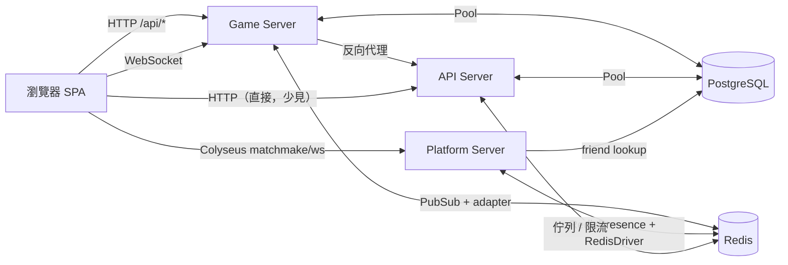
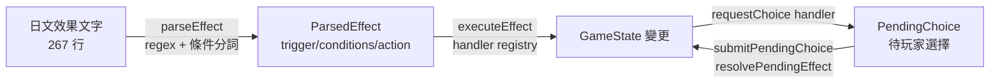
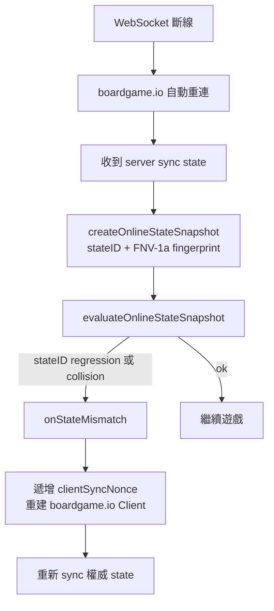

# ARCHITECTURE

ZUTOMAYO CARD Online 的系統架構文檔。本文說明前端 SPA、boardgame.io 遊戲伺服器、獨立 API 伺服器、Colyseus platform 伺服器之間的職責劃分與互動方式，並涵蓋遊戲邏輯、資料層、線上對戰流程、可觀測性與部署。

> 部署細節請參見 [DEPLOYMENT.md](./DEPLOYMENT.md)，REST API 端點請參見 [API.md](./API.md)，遊戲規則請參見 [rules.md](../rules.md)。

---

## 目錄

1. [系統概觀](#1-系統概觀)
2. [前端架構](#2-前端架構)
3. [Game Server 架構](#3-game-server-架構)
4. [API Server 架構](#4-api-server-架構)
5. [遊戲邏輯架構](#5-遊戲邏輯架構)
6. [資料層架構](#6-資料層架構)
7. [線上對戰流程](#7-線上對戰流程)
8. [可觀測性架構](#8-可觀測性架構)
9. [部署架構](#9-部署架構)

---

## 1. 系統概觀

系統由四個執行面組成：前端 SPA、boardgame.io 遊戲伺服器（game）、獨立 API 伺服器（api）、Colyseus platform 伺服器（platform）。game、api、platform 共用同一個 PostgreSQL 與 Redis 實例，並以 table 前綴 / Redis DB index 隔離資料。

```text
┌──────────────────────────────────────────────────────────┐
│                     前端 (Vite + React 19)                │
│   React Router 7 · Tailwind 4 · daisyUI 5 · boardgame.io │
│   Client · PWA (vite-plugin-pwa) · Sentry · 6 語 i18n    │
└───────────────┬──────────────────────────┬───────────────┘
                │ HTTP (/api/* 代理)        │ WebSocket (Socket.IO)
                │                            │ + boardgame.io sync
                │                            │ WebSocket/HTTP matchmake
                │                            │ + Colyseus platform
┌───────────────▼──────────────────────────▼───────────────┐
│              Game Server (port 3000, Koa)                 │
│  boardgame.io Server · Socket.IO + @socket.io/redis-adapter│
│  RedisPubSub (應用層廣播) · PostgresAdapter (state 持久化) │
│  /health · /metrics · /games/* rate limit · /api/* 代理    │
│  Helmet CSP · per-IP Socket connection limit              │
└───────────────┬──────────────────────────┬───────────────┘
                │                            │
        (PG Pool)                      (HTTP to api:3001)
                │                            │
┌───────────────▼────────┐  ┌────────────────▼────────────────┐
│   PostgreSQL 16        │  │      API Server (port 3001)      │
│   ─ zutomayo db        │  │  Node HTTP · service modules     │
│     ├ users/decks/     │  │  本地帳號 + Logto + Google/      │
│     │ matches/cards/   │  │  GitHub/Discord OAuth            │
│     │ feedback/...     │  │  Zod 驗證 · Redis rate limit     │
│     └ bjg_matches      │  │  防作弊驗證鏈 · ELO 計算          │
│   ─ logto db (獨立)    │  │  Prometheus /metrics · pino log  │
└────────────────────────┘  └─────────────────────────────────┘
                ▲                            ▲
                │                            │
                │              ┌─────────────▼────────────────┐
                │              │ Platform Server (port 3002)  │
                │              │ Colyseus rooms: lobby /      │
                │              │ quick_match / custom_room /  │
                │              │ invite / match_shell         │
                │              │ JWT cookie auth · friend     │
                │              │ presence lookup              │
                │              └─────────────▲────────────────┘
                │                            │
                └────────── Redis 7 ─────────┘
                   DB index 隔離（PubSub / Socket.IO adapter /
                   Colyseus driver/presence / rate limit / legacy queue）
```

### 各層職責

| 層              | 主要職責                                                                                                      | 技術                                                            |
| --------------- | ------------------------------------------------------------------------------------------------------------- | --------------------------------------------------------------- |
| 前端 SPA        | UI、路由、牌組編輯、教學、i18n、PWA、boardgame.io client（state sync + playerView）、Colyseus platform client | React 19、Vite 7、React Router 7、Tailwind/daisyUI、PWA         |
| Game Server     | boardgame.io 權威遊戲狀態、playerView 資訊隱藏、Socket.IO 連線、跨節點廣播、版本檢查                          | boardgame.io 0.50、Koa、Socket.IO、PostgresAdapter、RedisPubSub |
| API Server      | 帳號 / OAuth / 牌組 / 對戰結果 / 聊天持久化 / 好友 / 反饋 / 管理 / 卡牌資料 / legacy REST 配對                | Node HTTP、pg、ioredis、zod、node-pg-migrate                    |
| Platform Server | Colyseus lobby presence、quick matchmaking、custom-room lifecycle、invite、match shell、spectator presence    | Colyseus、@colyseus/ws-transport、RedisDriver、RedisPresence    |
| PostgreSQL      | 持久資料（用戶、好友、牌組、對戰、聊天、檢舉、制裁、卡牌、反饋、boardgame.io state）                          | PostgreSQL 16                                                   |
| Redis           | 跨節點同步、Colyseus room/presence backing、refresh 原子輪替、legacy 配對佇列、限流、HTTP presence fallback   | Redis 7（密碼、AOF + noeviction）                               |

### 請求/同步流向



---

## 2. 前端架構

### React + Vite SPA

- **入口**：`src/main.tsx` → `src/App.tsx`（路由 + NavBar + 教學 overlay + 重連提示）。
- **路由**：React Router 7，路徑定義於 `src/pages/`（大廳、AI/線上/教學對戰、牌組編輯器、對戰紀錄、排行榜、反饋看板、個人頁、管理後台）。
- **建構**：Vite 7，Strict TypeScript。`npm run build` 會先跑 `typecheck` + `typecheck:scripts` 再 `vite build`。
- **Design System v1**：`src/ui/` 提供 `primitives/`、`layout/`、`game/`、`feedback/`、`forms/`、`tokens/`（colors / spacing / typography / z-index / motion）。

### boardgame.io Client

- 線上對戰透過 `boardgame.io/react` 的 `Client({ game, board, multiplayer: SocketIO() })` 建立（`src/components/OnlineGame.tsx`）。
- Client 收到的是 `playerView` 處理後的 state（對手手牌 / 牌組 / 蓋牌被隱藏），所有 move 送到 game server 由 boardgame.io Master 跑 reducer。
- AI 對戰與本機對戰直接在瀏覽器內用 `ZutomayoCard` 的 reducer 模擬，不經過 server。

### 狀態管理

| 狀態                       | 來源                                           | 消費方式                               |
| -------------------------- | ---------------------------------------------- | -------------------------------------- |
| 遊戲盤面 `G` / `ctx`       | boardgame.io client（server 權威）             | React props（`BoardProps<GameState>`） |
| 連線狀態                   | boardgame.io client `isConnected`              | `OnlineGame` 的 `useState`             |
| state mismatch 快照        | `onlineStateGuard.ts`（stateID + fingerprint） | `OnlineBoard` 的 `useRef`              |
| 線上 session               | `onlineSession.ts`（localStorage）             | `App.tsx` 啟動時載入                   |
| 牌組 / 對戰紀錄 / 語言偏好 | API + localStorage                             | React hooks                            |

### PWA

- `vite-plugin-pwa` 產生 Service Worker 與 manifest（`src/clientVersion.ts`）。
- **自動更新**：`registerPwaAutoUpdate()` 註冊 SW，`onNeedRefresh` 時派發 `zutomayo:pwa-update-ready` 事件，由 `PwaStatusPrompt` 提示使用者。
- **強制復原**：`recoverPwaAndReload()` 會 unregister 所有 SW 並清空 caches 後重整，用於偵測到壞版本時。
- **版本相容**：`ensureCompatibleAppVersion()` 比對 `/api/app-version` 與本地 `APP_VERSION_INFO`，不符時拋 `VersionMismatchError` 並提示重整。

### i18n（6 語）

| 語言             | 代碼  | 檔案                |
| ---------------- | ----- | ------------------- |
| 繁體中文（台灣） | zh-TW | `src/i18n/zh-TW.ts` |
| 粵語（香港）     | zh-HK | `src/i18n/zh-HK.ts` |
| 簡體中文         | zh-CN | `src/i18n/zh-CN.ts` |
| 日本語           | ja    | `src/i18n/ja.ts`    |
| English          | en    | `src/i18n/en.ts`    |
| 한국어           | ko    | `src/i18n/ko.ts`    |

- 核心 `t()` / `translate()` 在 `src/i18n/index.ts`，語言偏好存 localStorage。
- 卡牌名稱與效果由 API `/api/cards/texts` 一次載入；日英投影自 `cards`，衍生語言來自 `card_texts_i18n`，顯示統一經 `game/cards/i18n.ts` 處理。

---

## 3. Game Server 架構

入口：`src/server.ts`。以 boardgame.io 的 `Server({ games, db, transport, origins, authenticateCredentials })` 為核心，外層包 Koa 中間件。

### boardgame.io Server 配置

```text
Server({
  games: [ZutomayoOnlineCard],
  db: PostgresAdapter,                 // 自實作 StorageAPI.Async
  transport: SocketIO({
    socketAdapter: @socket.io/redis-adapter,
    pubSub: RedisPubSub,               // 自實作 GenericPubSub
  }),
  origins: [localhost, ALLOWED_ORIGINS],
  authenticateCredentials,             // credentials + 版本相容檢查
})
```

啟動流程（`bootstrap()`）：

1. `validateSecurityConfig()` — 強制 `JWT_SECRET` 存在。
2. `loadCardsFromPG()` — 從 PG `cards` / `card_texts_i18n` 載入卡牌定義（boardgame.io setup 需要卡牌才能初始化牌組），失敗重試 5 次。
3. `server.run(PORT)` — 啟動 Koa + Socket.IO。
4. 附加 Socket.IO per-IP connection limiter（`MAX_CONN_PER_IP`，預設 10）。
5. 啟動 stale match 清理排程（預設每 5 分鐘清除 30 分鐘以上未更新的對戰）。

### PostgresAdapter（`src/server/db/postgres-adapter.ts`）

boardgame.io `StorageAPI.Async` 的 PostgreSQL 實作。duck-typed（`type()=1` + 6 方法齊全），不繼承內部抽象類別。

**Schema**（與 API 共用同一個 PG instance，用 `bjg_` 前綴隔離）：

```sql
bjg_matches(
  match_id       TEXT PRIMARY KEY,
  state          JSONB,
  initial_state  JSONB,
  metadata       JSONB NOT NULL,
  log            JSONB NOT NULL DEFAULT '[]'::jsonb,
  updated_at     TIMESTAMPTZ NOT NULL DEFAULT NOW()
)
```

**並發控制三層機制**（避免多實例同時處理 move 造成覆蓋）：

| 機制                   | 實作位置                                           | 作用                                                                                                         |
| ---------------------- | -------------------------------------------------- | ------------------------------------------------------------------------------------------------------------ |
| Row lock（FOR UPDATE） | `fetchStateForUpdate()`                            | boardgame.io `onUpdate` fetch state 時取該 row 的 transaction lock，其他實例的同一 move 會阻塞直到 lock 釋放 |
| stateID guard          | `writeState()` 的 `WHERE ... _stateID = $expected` | UPDATE 條件檢查 `_stateID` 單調遞增，舊 stateID 寫入會 `rowCount=0` 並拋 `StaleStateWriteError`              |
| 樂觀鎖逾時             | `updateLocks` Map + 5 秒 setTimeout                | 防止 lock 永不釋放；逾時自動 ROLLBACK 並 release client                                                      |

deltalog append 使用 PG `||` JSONB concat operator，單一 UPDATE 即原子完成（state + log + updated_at）。

### Socket.IO + @socket.io/redis-adapter

- 連線層 rooms/sockets 同步跨節點：當 client 連到節點 A 但 match room 在節點 B，adapter 透過 Redis 轉發 `join`/`emit` 訊息。
- 由 `createAdapter(redisPubClient, redisAdapterSubClient)` 注入 `SocketIO({ socketAdapter })`。
- per-IP connection limiter 在 `io.on('connection')` 計數，超過 `MAX_CONN_PER_IP` 直接 `socket.disconnect(true)`。

### RedisPubSub（`src/server/transport/redis-pubsub.ts`）

- 應用層 `sendAll` payload 廣播：boardgame.io Master 產生的 update/patch/sync/matchData/chat 透過 Redis Pub/Sub 跨節點傳遞。
- channel 命名 `MATCH-{matchID}`（boardgame.io 內部約定）。
- publish 用一條連線，subscribe 用 `duplicate()` 出來的另一條連線（ioredis 限制：進入 subscribe 模式的連線只能 subscribe/unsubscribe/quit）。

### 為什麼需要雙層 Redis

boardgame.io 多實例需要**兩個獨立的跨節點層**，兩者職責不同、缺一不可：

| 層                         | 處理對象                                | 不注入的後果                                               |
| -------------------------- | --------------------------------------- | ---------------------------------------------------------- |
| `@socket.io/redis-adapter` | Socket.IO **連線層** rooms/sockets 同步 | client 連到節點 A，但 room 在節點 B → 收不到事件           |
| `RedisPubSub`（應用層）    | boardgame.io **sendAll payload** 廣播   | 節點 A 處理 move 後，節點 B 上的 client 永遠收不到新 state |

兩者皆透過 `SocketIO({ socketAdapter, pubSub })` 注入。`InMemoryPubSub`（boardgame.io 預設）只能送到本節點，多實例下會造成部分 client 看不到更新。

### authenticateCredentials（版本相容性檢查）

`authenticateVersionedCredentials(credentials, playerMetadata)`：

1. 比對 `credentials === playerMetadata.credentials`（boardgame.io 預設行為）。
2. 額外檢查 `playerMetadata.data.clientVersion` 經 `compatibleClientVersion()` 視為相容（`isCompatibleVersion` 比 app / build / rules version）。

`/games/zutomayo-card/:id/join` 與 `/resume` 路由會在多個位置檢查版本：客戶端版本、房間 setupData 版本、對手座位版本，任一不符回 `426 Upgrade Required`，避免不同版本玩家混戰。

### playerView 資訊隱藏（`src/game/Game.ts`）

`playerView({ G, playerID })` 依 viewer 視角改寫 state，避免對手從封包窺探資訊：

| 欄位                               | 對 owner                       | 對對手                                                          |
| ---------------------------------- | ------------------------------ | --------------------------------------------------------------- |
| `players[i].hand`                  | 原始                           | 非揭示卡 → `__hidden__` placeholder                             |
| `players[i].deck`                  | faceDown 卡 → `__hidden__`     | faceDown 卡 → `__hidden__`                                      |
| `battleZone`/`setZoneA`/`setZoneB` | 原始                           | faceDown → `__hidden__`                                         |
| `jankenChoices`                    | 雙方都出拳後公開 / 自己的選擇  | 對手未出拳前為 `null`                                           |
| `pendingChoice`                    | 屬於自己時完整                 | 屬於對手時 `options: []`                                        |
| `actionLog`                        | 卡牌翻開後允許顯示 `cardDefId` | 戰鬥結算前 `setInitialCard`/`setTurnCard` 的 `cardDefId` 被刪除 |

教學模式（`tutorialSkipShuffle`）下 AI 視角可看到玩家出拳，確保 AI 能配合「故意輸」的教學流程。

---

## 4. API Server 架構

入口：`api/server.cjs`（CommonJS，Node 原生 `http` server）。搭配 service 模組與 zod schema。

### Service 模組

| 模組                          | 職責                                                                           |
| ----------------------------- | ------------------------------------------------------------------------------ |
| `accountService.cjs`          | 本地帳號註冊/登入、OAuth 身份連結/查詢/解除、密碼變更                          |
| `adminService.cjs`            | Admin 登入、使用者列表、ELO 重設                                               |
| `adminCardService.cjs`        | 卡牌資料與效果翻譯寫入（`upsertCard` / `upsertCardI18n` / `upsertGameConfig`） |
| `cardDataService.cjs`         | 卡牌列表、單卡、i18n、動態設定、預設牌組（公開唯讀）                           |
| `chatService.cjs`             | 持久化聊天、歷史同步、未讀、翻譯、檢舉、證據快照、審核與禁言制裁               |
| `chatTranslationProvider.cjs` | 可配置 HTTP/LLM 翻譯 provider，未配置時讓 ChatService 保持 pending 合約        |
| `deckService.cjs`             | 個人牌組 CRUD                                                                  |
| `friendService.cjs`           | 好友新增 / 列表 / 移除，供 lobby 與 platform friend presence 使用              |
| `presenceService.cjs`         | 線上人數 presence heartbeat / 計數                                             |
| `matchQueries.cjs`            | 排行榜、個人對戰歷史、admin 對戰列表、已清理 action log                        |
| `matchSubmission.cjs`         | 對戰結果上報 + ELO 計算（呼叫 `matchVerification`）                            |
| `matchVerification.cjs`       | 防作弊驗證（見下節）                                                           |
| `feedbackService.cjs`         | 反饋看板（文章、投票、留言、標籤、emoji 反應、圖片附件、重複標記）             |
| `imgproxySigner.cjs`          | imgproxy 簽名 URL 產生與來源白名單                                             |
| `observability.cjs`           | pino log、Prometheus metrics、request tracing                                  |

### 卡牌圖片交付規範

- 卡牌資料可以保存 canonical 原始 URL；這只是來源資料，不代表瀏覽器可直接載入原圖。
- 所有玩家端、Admin 與教學 UI 必須使用 `CardImage`。它會透過同源 `/api/imgproxy` 產生尺寸化的 AVIF/WebP/srcset，預設在 imgproxy 失敗時 fail closed，不得靜默回退至原始 R2 URL。
- 若特殊 UI 確實需要原圖回退，必須同時傳入 `fallbackToOriginal={true}` 與非空的 `originalFallbackReason`，在本節記錄用途，並同步審查 CSP／效能 gate 的明確例外。Public Beta 玩家 UI 目前沒有此例外。
- PWA 只快取 `/api/imgproxy/` 回應；Content Security Policy 不允許玩家端直接向卡圖來源站載入圖片。
- `npm run image:policy` 會掃描直接 `` 卡圖、未說明的原圖回退、PWA 原圖快取與 CSP 放行；`npm run verify` 包含此檢查。效能 smoke 也會把任何繞過 imgproxy 的實際圖片請求視為失敗。
- 唯一既有直接來源例外是 `scripts/card-official-text-review-server.ts`：這是 localhost-only 的官方文本人工審查工具，沒有 App/imgproxy runtime；本機 OCR 圖片不存在時會導向 canonical 原圖以供核對。它不會進入玩家端 bundle 或部署服務。

### 認證流程

```mermaid
flowchart LR
    Local[本地 email/password] --> Hash[PBKDF2-SHA512\n100000 迭代]
    Hash --> JWT[HMAC-SHA256 JWT\n7 天效期]
    OAuth[OAuth provider] --> State[簽名 state\nHMAC]
    State --> Authorize[導向 provider]
    Authorize --> Callback[/api/oauth/:p/callback]
    Callback --> Exchange[交換 code → access_token]
    Exchange --> Profile[取 userInfo]
    Profile --> LinkOrLogin[查 user_identities\n已連結 → 登入 / 未連結 → 建帳號或連結]
    LinkOrLogin --> JWT
    JWT --> Cookie[Set-Cookie: zutomayo_session\nHttpOnly, SameSite, Secure]
```

**OAuth provider（4 個）**：

| Provider | 設定來源                                                  | 備註                                       |
| -------- | --------------------------------------------------------- | ------------------------------------------ |
| Logto    | `LOGTO_ISSUER` / `LOGTO_ENDPOINT`，discovery URL 自動組裝 | 同時作為 Account Center 後端（密碼變更等） |
| Google   | `GOOGLE_OAUTH_CLIENT_ID` / `GOOGLE_OAUTH_CLIENT_SECRET`   | OIDC                                       |
| GitHub   | `GITHUB_OAUTH_CLIENT_ID` / `GITHUB_OAUTH_CLIENT_SECRET`   | 需额外抓 `/user/emails`                    |
| Discord  | `DISCORD_OAUTH_CLIENT_ID` / `DISCORD_OAUTH_CLIENT_SECRET` | `identify email` scope                     |

- `AUTH_MODE`（`hybrid` / `logto`）控制是否啟用本地帳號；`logto` 模式只允許 Logto 登入。
- OAuth state 以 `JWT_SECRET` HMAC 簽名，防止 CSRF；callback 驗證後產生 session ticket。
- OAuth token set（access/refresh）以 AES-256-GCM 加密存於 `user_identities`（金鑰衍生自 `JWT_SECRET`）。

### Session / Cookie 管理

- Cookie 名：`zutomayo_session`，內容為 JWT（`sub`/`userId`/`iat`/`exp`，7 天）。
- 屬性：`HttpOnly`、`SameSite=Lax`（可設 `Strict`/`None`）、HTTPS 下自動 `Secure`、可設 `Domain`。
- 相容舊版 Bearer token：`getAuthUserId(req)` 先查 Cookie，再查 `Authorization: Bearer`。
- `clearAuthCookie` 於 logout 時以 `Max-Age=0` 覆寫。

### 防作弊驗證鏈

`POST /api/matches` 上報對戰結果時，由 `matchVerification.cjs` 的 `verifyBoardgameMatchResult()` 執行五步驗證：

```text
authUserId（JWT） ──1──> winnerId === authUserId           ── 上報者必須是贏家
                  ──2──> sourceMatchId 必須存在於 bjg_matches
                  ──3──> boardgame.io state.ctx.gameover 已結束
                  ──4──> state 的 authoritativeWinner === winnerPlayer
                  ──5──> metadata.players[winner].data.userId === authUserId
                         （贏家座位綁定到認證使用者）
```

任一步驟失敗回 `4xx` 並拒絕寫入。通過後 `matchSubmission.cjs` 在 transaction 內：

1. 檢查 `matches.source_match_id` 唯一（`ON CONFLICT` / 預先 SELECT），避免同一場重複上報。
2. 用 `calculateElo()`（K=32）計算雙方 ELO 變動並 `UPDATE users`。
3. `INSERT INTO matches` 含 `source_match_id`、ELO 變動、已清理 action log。

### Rate limiting

- **API server**：Redis fixed-window per-IP per-minute。`/api/login`、`/api/register`、`/api/admin/login` 為 `10/min`，其餘 `120/min`。被擋回 `429` 並 `inc(rate_limited_requests_total)`。
- **Game server**：`/games/*` 路由 `120/min`（`createRateLimit`，`src/server/rateLimit.ts`）+ per-IP Socket.IO 連線上限。
- 兩者皆 **fail open**：Redis 不可用時放行請求，避免 Redis 故障擋掉全部流量。

### Input validation（Zod）

- `api/schemas.cjs` 定義所有請求 body 的 zod schema（註冊、登入、牌組、對戰上報、配對、反饋、admin 等）。
- `api/validate.cjs` 的 `validateBody()` 在 handler 前執行，失敗回 `400` 並附 zod 問題清單。
- 額外 sanitization：`sanitizeText`（限長）、`sanitizeActionLog`（剝離敏感 / 過大欄位）、`sanitizeHp`、`finiteNumber`。

---

## 5. 遊戲邏輯架構

### Game.ts（boardgame.io Game 定義）

`src/game/Game.ts` 匯出三個 variant：

| 匯出                 | 用途                   | 特性                                                                                         |
| -------------------- | ---------------------- | -------------------------------------------------------------------------------------------- |
| `ZutomayoCard`       | 本機 / AI / 教學       | 允許 `skipShuffle`、不強制 `clientVersion`                                                   |
| `ZutomayoOnlineCard` | 線上對戰               | `validateSetupData` 強制 `requireClientVersion`，`setup` 強制 `skipShuffle: false`（防作弊） |
| `createZutomayoCard` | 工廠（給本機自訂牌組） | 允許 browser custom deck name、`allowSkipShuffle`                                            |

定義包含：`name`、`setup`、`validateSetupData`、`playerView`、`moves`、`turn`（`activePlayers: { all: 'simultaneous' }`）、`endIf`。

**Moves**：`janken` / `mulligan` / `keepHand` / `setInitialCard` / `setTurnCard` / `undoSetCard` / `confirmReady` / `timeoutSkip` / `resolvePendingEffect` / `submitPendingChoice`。每個 move 透過 `playerIndex(playerID)` 收窄型別後委派給 `GameLogic` 的純函式，失敗回 `INVALID_MOVE` sentinel。

### GameLogic.ts（核心流程）

`src/game/GameLogic.ts` 為**確定性狀態機**，由 `GameState.step` 驅動，不依賴 boardgame.io 的回合制：

```text
setupGame
   │  洗牌、發 5 張手牌、init HP 100、chronos.position=0
   ▼
mulligan ──(finishMulligan)──> initialSet
   │  玩家選擇重抽 0~5 張
   ▼
initialSet ──(setInitialCard + confirmReady)──> effectOrder
   │  各自設置 1 張角色到 battleZone
   ▼
turnSet ──(setTurnCard + confirmReady)──> effectOrder
   │  出牌到 setZoneA/B（敗者可出 2 張追趕）
   ▼
effectOrder ──(processTurnEffects)──> battle
   │  依 chronos 決定效果優先順序，執行 pending effects
   ▼
battle ──(resolveBattle)──> finishTurn ──> turnSet（下一回合）
   │  傷害結算、HP=0 判定
   ▼
gameOver（endIf 回傳 { winner } 或 { draw: true }）
```

- `turn.onBegin` 設 `G.turnStartTime = Date.now()`，作為伺服器權威回合計時基準（`TURN_TIMER_MS = 60_000`）。
- `timeoutSkip` move 由伺服器在超時時強制跳過該玩家回合，避免卡死。
- `setup` 強制 `skipShuffle: false`（線上），防止惡意客戶端固定牌序。

### 效果引擎：parser → executor → choices



**`effects/parser.ts`（DSL 解析）**：

- `parseEffect(rawText)` 將日文效果文字轉成 `{ trigger, conditions[], action, priority?, expiry? }`。
- 步驟：正規化（去 `<br>`/`<a>`/`※`）→ 偵測 trigger（`onUse`/`onTurnStart`/`onTurnEnd`/`onBattle`/`onDamageReceived`/`onChronosChanged`/`onZoneEntered`）→ 拆出條件（chronos / element / HP / powerCost / zoneCount / namedCard ...）→ `parseAction` 對應到 `ActionType`。
- `parseAllEffects()` 批次解析所有卡牌，並合併 `expiry`（Area Enchant 自動失效條件）與 secondary effects。
- 覆蓋率：422 張卡 / 250 張效果卡 / 267 行效果 100% 解析。

**`effects/executor.ts`（handler registry）**：

- `effectHandlers: Record<ActionType, EffectHandler>` 分派 36 種 action type（boostAttack / heal / directDamage / clockSet / moveSelfAreaEnchant / useFromAbyss / requestChoice ...）。
- `evaluateCondition()` 評估 30+ 種 condition type，含 `and`/`or` 複合條件。
- `processTurnEffects()` 依 `getTurnEffectPlayerOrder()`（夜側優先）+ priority（`normal`/`late`）逐效果執行；執行前再檢查 power cost 與禁用狀態。
- 效果拋例外時 `Sentry.captureException` 上報，不中斷整局流程。
- 官方 QA 規則（Q18/Q21/Q22/Q40/Q54/Q63/Q65/Q74/Q82/Q83 等）內嵌於 handler 邏輯。

**`effects/choices.ts` / `requestChoices.ts`**：`requestChoice` action 會建立 `PendingChoice`，由 `submitPendingChoice` / `resolvePendingEffect` move 處理玩家選擇後再繼續效果鏈。

### AI 決策（`src/game/ai.ts`）

三種難度：

| 難度   | 策略                                                                                                                                                      |
| ------ | --------------------------------------------------------------------------------------------------------------------------------------------------------- |
| easy   | 依 `scoreCard`（攻擊力 / power cost / clock）排序後取最高分卡                                                                                             |
| normal | 同 easy，但會避開 power cost 不足的卡                                                                                                                     |
| hard   | `hardLookahead()`：枚舉所有手牌組合 × slot 分配，`simulateBattle()` 模擬戰鬥，以 `(damageDealt - damageReceived, damageDealt, heuristicScore)` 比較選最佳 |

`simulateBattle` 用 `structuredClone(G)` 複製狀態後跑 `revealCards` → `advanceChronos` → `placeRevealedCards` → `resolveBattle`，計算 HP 差分。`useAIMoves.ts` 是 React hook，自動驅動 AI 出牌。

### Chronos 時鐘系統（`src/game/chronos.ts`）

- 圓形時鐘，`CHRONOS_MAPPING.positions` 個位置，position 0 為真夜中（midnight）。
- `getChronosTimeForPosition(position, midnightRange)`：判斷該位置是 `night` 或 `day`；`midnightRange` 可擴大真夜中範圍（效果 `expandMidnightRange`）。
- 角色攻擊力有 `attack.night` / `attack.day` 兩個值，由當前 chronos 時間決定使用哪個。
- `nightSidePlayer` 決定效果優先順序（夜側玩家先處理效果）。

---

## 6. 資料層架構

### PostgreSQL

- **兩個 database**：
  - `zutomayo`：應用資料（users / decks / matches / cards / card_texts_i18n / game_config / preset_decks / admin_audit_log / feedback\*\* / `bjg_matches`）。
  - `logto`：Logto 自管的身份 / session database（獨立，不由本專案 code 直接存取）。
- **table 隔離**：boardgame.io state 用 `bjg_` 前綴（`bjg_matches`），其餘 API table 無前綴，兩者共存於同一個 `zutomayo` database。

### Redis（DB index 隔離）

Redis 同時扮演五種角色，全部透過 `REDIS_DB` 切到獨立 DB index（0-15）隔離：

| 角色                       | key 模式                       | 說明                                              |
| -------------------------- | ------------------------------ | ------------------------------------------------- |
| boardgame.io PubSub        | `MATCH-{matchID}` channel      | `RedisPubSub` 跨節點 sendAll 廣播                 |
| `@socket.io/redis-adapter` | 內部 key                       | Socket.IO rooms/sockets 同步（無法 prefix）       |
| Colyseus rooms/presence    | Colyseus driver/presence keys  | Platform service 多實例 room discovery / presence |
| Rate limit                 | `ratelimit:{ns}:{ip}:{window}` | `INCR` + `EXPIRE` 跨實例計數                      |
| Presence                   | presence 相關 key              | 線上人數 heartbeat                                |

> **為什麼用 DB index 而非 key prefix**：boardgame.io 內部 channel `MATCH-{matchID}` 與 `@socket.io/redis-adapter` 內部 key 無法從應用碼 prefix，唯有 DB index 能完整隔離。`duplicate()` 出的連線會繼承 `db` 選項。

### Schema migration（node-pg-migrate）

- Migration 檔案位於 `migrations/`，初始 migration `000001_init_schema.js` 用 `pgm.createTable` / `createIndex` / `addColumn` + `ifNotExists: true`，安全可重複執行。
- `scripts/db-migrate.cjs` 將 `PG_*` 環境變數組裝成 `databaseUrl`（`DATABASE_URL` 優先）。
- **Docker Compose**：`migrate` 服務在 `api` 啟動前跑 `npm run db:migrate`，`api` 以 `depends_on: service_completed_successfully` 等待。
- **Fallback**：production API image 不含 `node-pg-migrate`（devDependency）與 `migrations/`，`api/server.cjs` 的 `runMigrations()` 偵測不到時 fallback 到 `initSchema()`（`CREATE TABLE IF NOT EXISTS`）自癒。

### 連線池配置

| 服務      | Pool 來源               | `max`              | `idleTimeoutMillis` | `connectionTimeoutMillis` |
| --------- | ----------------------- | ------------------ | ------------------- | ------------------------- |
| Game (主) | `PostgresAdapter`       | `PG_POOL_MAX`或 20 | 30s                 | 5s                        |
| Game (卡) | `cardPool`（server.ts） | 5                  | 30s                 | 5s                        |
| API       | `pool`（server.cjs）    | `PG_POOL_MAX`或 20 | 30s                 | 5s                        |

Graceful shutdown 時 `db.close()` / `cardPool.end()` / `redisPubClient.quit()` 釋放所有連線。

---

## 7. 線上對戰流程

### 配對（Colyseus quick_match）

目前前端線上快速配對主路徑是 Colyseus `quick_match` room：

```text
connectPlatformQuickMatch()
  ├─ Colyseus matchmake joinOrCreate quick_match
  ├─ QuickMatchRoom 等待第二位玩家
  ├─ matched 後鎖房並指定 host / guest
  ├─ host 建立 boardgame.io match，但暫不離開 lobby
  ├─ host 透過 quick_match room 廣播 boardgameMatchReady
  └─ host / guest 都拿到 boardgameMatchID 後再進入 boardgame.io match
```

配對 lifecycle、取消、match ID relay 都由 Colyseus 房間承擔，boardgame.io 只負責實際卡牌對局。舊 REST polling、Redis `mm:*` 佇列與 `realMatchId` handoff 已移除。

### 建房 / 加入

- Colyseus quick match 成功後 **host** 用 boardgame.io lobby API `createMatch`（setupData 帶 `clientVersion`、雙方 deck 名/ids），取得 `matchID`。
- host 透過 `quick_match` room 的 `boardgameMatchReady` 訊息回報 boardgame.io `matchID`，雙方再進入同一個 boardgame.io match。
- 雙方各自 `POST /games/zutomayo-card/:id/join`：帶 `playerName` / `data` / `clientVersion`，server 驗版本後 `generateCredentials` 並 `setMetadata`。
- client 將 `{ matchID, playerID, playerCredentials }` 存入 localStorage（`onlineSession.ts`）。

### 遊戲進行（state sync、playerView）

- boardgame.io client 透過 Socket.IO 連線，所有 move 送到 game server。
- Master 跑 reducer → `PostgresAdapter.setState`（含 stateID guard）→ `RedisPubSub.publish` 廣播 → 各節點 client 收到新 state。
- `playerView` 在送出前過濾對手隱藏資訊（見 §3）。
- `OnlineBoard` 監聽 `matchData` Socket.IO 推送偵測對手加入（取代 HTTP 輪詢）。

### 斷線重連（state mismatch 偵測 + client rebuild）



- `onlineStateGuard.ts` 對 `{ stateID, G, ctx }` 做 stable stringify + FNV-1a hash 形成 fingerprint。
- 偵測到 `stateID-regressed`（stateID 倒退）或 `stateID-collision`（同 stateID 但 fingerprint 不同）時，`Sentry.captureException` 上報並重建 client，丟棄本地 state 改用 server 權威 state。
- 啟動時 `App.tsx` 用 `loadOnlineSession()` + `validateOnlineSession()`（呼叫 `/resume`）判斷是否可恢復座位，依回應分類 `versionMismatch` / `roomGone` / `seatTaken` / `network`。

### 對戰結束（結果驗證 + ELO 計算）

1. boardgame.io `endIf` 回傳 `{ winner }` 或 `{ draw: true }`，state 寫入 `bjg_matches`。
2. 贏家客戶端 `POST /api/matches` 帶 `sourceMatchId` + `winnerPlayer`。
3. `matchVerification.verifyBoardgameMatchResult()` 跑五步驗證鏈（§4）。
4. `matchSubmission.submitMatchResult()` 在 PG transaction 內：檢查 `source_match_id` 唯一 → `calculateElo` → `UPDATE users` ELO/wins/match_count → `INSERT matches`。
5. action log 經 `sanitizeActionLog` 清理後存入，`GET /api/matches/:id/log` 公開讀取（不含敏感資訊）。

---

## 8. 可觀測性架構

### pino 結構化日誌（AsyncLocalStorage request-scoped logger）

`src/server/observability/logger.ts`（game）與 `api/observability.cjs`（api）：

- 每個 request 透過 `requestLoggingMiddleware()` 建立 `logger.child({ requestId })`，存入 `AsyncLocalStorage`。
- `getRequestLogger()` 在非同步鏈中任意位置取回 request-scoped logger，所有 log 自動帶 `requestId`。
- `X-Request-Id` header：優先使用 forwarded header，否則 `crypto.randomUUID()` 產生並回寫 response header。
- 敏感欄位 redact：`req.headers.authorization`、`req.headers.cookie`、`*.password`、`*.token`。
- `LOG_LEVEL` 環境變數控制（`trace`/`debug`/`info`/`warn`/`error`/`fatal`，預設 `info`）。

### Prometheus metrics

`/metrics` 端點（兩個服務皆暴露，可設 `METRICS_TOKEN` Bearer 保護）：

| Metric                          | 類型      | 服務 | 說明                                                                   |
| ------------------------------- | --------- | ---- | ---------------------------------------------------------------------- |
| `http_request_duration_seconds` | Histogram | 兩者 | labels: `method`/`path`/`status`，path 正規化（`:id`）限制 cardinality |
| `http_requests_total`           | Counter   | 兩者 | 同上 labels                                                            |
| `rate_limited_requests_total`   | Counter   | api  | label: `pathname`                                                      |
| `active_socket_connections`     | Gauge     | game | 當前 Socket.IO 連線數                                                  |
| Node.js default metrics         | -         | 兩者 | event loop / GC / heap（`collectDefaultMetrics`）                      |

### Sentry 錯誤追蹤

- `@sentry/node` 10.x，`SENTRY_DSN` 未設時 no-op（支援 GlitchTip）。
- release = `${APP_VERSION}@${APP_BUILD_ID}`，`tracesSampleRate` 可調。
- `beforeSend` 移除 request 中的 headers / cookies / body，避免 token / 密碼外洩。
- 服務 tag：`service: 'game' | 'api'`，`app: 'zutomayo-card'`。
- 效果執行例外、socket 錯誤、API proxy 錯誤、state mismatch 皆自動上報並帶結構化 tag（`layer`/`action_type`/`match_id`/`reason`）。
- 前端 `src/sentry.ts` 同樣初始化，線上模式自動 set tag `match_mode: 'online'`、`game_phase: <step>`。

### Health check

`GET /health`（game server）：

```json
{
  "status": "ok" | "degraded",
  "checks": { "postgres": "up" | "down", "redis": "up" | "down" }
}
```

- 任一相依服務 down → `503` + `status: degraded`。
- `Cache-Control: no-store`，供 Docker healthcheck 與 load balancer 使用。
- 定期 `cleanupStaleMatches()` 清除逾時對戰（預設 30 分鐘 TTL，每 5 分鐘掃描）。

---

## 9. 部署架構

### Docker multi-stage build

`Dockerfile`（game server）兩階段：

1. **builder**（`node:22-alpine`）：`npm ci` → `COPY . .` → `npm run build`（含 typecheck + vite build）→ 刪除 source map。可選上傳 source map 到 GlitchTip（`SENTRY_URL`/`SENTRY_AUTH_TOKEN`）。
2. **runtime**（`node:22-alpine`）：`npm ci --omit=dev` → 從 builder COPY `dist` / `src` / `data` / `scripts` → `USER node` → `CMD ["npm", "run", "server"]`。

`api/Dockerfile` 為 API server 獨立鏡像（不含 `node-pg-migrate` 與 `migrations/`，靠 `initSchema()` fallback）。

### docker-compose 六個單元（含 one-shot migrate）

```text
postgres ─┬─> migrate (one-shot: npm run db:migrate) ─> api :3001
          ├─> game :3000 (boardgame.io + SPA + /api proxy)
          └─> platform :3002 (Colyseus rooms)

redis ────┬─> game (Pub/Sub + Socket.IO adapter + rate limit)
          ├─> api (rate limit + legacy compatibility queue)
          └─> platform (RedisDriver + RedisPresence)
```

| 服務     | 鏡像                     | healthcheck             | depends_on                                                        |
| -------- | ------------------------ | ----------------------- | ----------------------------------------------------------------- |
| postgres | `postgres:16-alpine`     | `pg_isready`            | -                                                                 |
| redis    | `redis:7-alpine`         | `redis-cli ping`        | -                                                                 |
| migrate  | builder stage            | -                       | postgres healthy                                                  |
| game     | 自建                     | `wget --spider /health` | postgres healthy + redis healthy                                  |
| api      | 自建（`api/Dockerfile`） | `wget --spider /health` | postgres healthy + redis healthy + migrate completed_successfully |
| platform | 自建                     | `wget --spider /health` | postgres healthy + redis healthy + api healthy                    |

- **必要環境變數**：`PG_PASSWORD`、`JWT_SECRET`（≥32 字元，建議 `openssl rand -hex 32`）。
- **Volumes**：`pg-data`（PG 資料目錄，唯一真實來源）、`redis-data`（AOF 持久化，遺失可接受＝冷重啟）。
- PG/Redis 預設不對外發布 port，只在 compose network 內可達。

### 水平擴展策略

- **game / api / platform 可多實例**：增加 replica 數即可。PG 與 Redis 維持單實例；platform 多實例需使用 `PLATFORM_REDIS_MODE=redis`。
- **共享狀態**：
  - boardgame.io state → `PostgresAdapter` 寫 `bjg_matches`（stateID guard 防覆蓋）。
  - 跨節點廣播 → `RedisPubSub` + `@socket.io/redis-adapter`。
  - Colyseus lobby / quick_match / custom_room / invite / match_shell → `RedisDriver` + `RedisPresence`。
  - API 認證狀態 / 限流 → Redis shared。
- **一致性要求**：所有同服務實例必須共享 `JWT_SECRET`、`REDIS_PASSWORD`；game / api 的 `ALLOWED_ORIGINS` 需一致，API 只應在 `TRUSTED_PROXY` 中列出真實反向代理，且 `APP_BUILD_ID` / `GAME_RULES_VERSION` 一致（否則 client 會被版本檢查擋下）。
- **復用既有 PG/Redis**：用獨立 database（PG）與獨立 DB index（Redis）隔離，`docker-compose.override.yml` 移除內建 postgres/redis 服務。

### CI/CD pipeline

GitHub Actions（`.github/workflows/ci.yml`），`ubuntu-latest` + Node 22 + npm cache，push/PR 到 `master` 時執行：

```text
checkout → setup-node → npm ci
  → format:check:tracked (Prettier)
  → version:check  (root / api package version sync)
  → lint           (ESLint)
  → typecheck      (tsc --noEmit, app)
  → typecheck:scripts
  → test           (vitest 單元測試)
  → build          (typecheck + typecheck:scripts + vite build)
```

平行的 `e2e` job 以 `docker-compose.e2e.yml` 啟動隔離服務棧並執行 Playwright，失敗時上傳 report 與 test results。任一步驟失敗皆阻擋合併。`smoke:*` 與 k6 `load:*` 仍需依目標環境另行執行；本機以 `npm run verify` 對齊靜態檢查、單測與 build。

`.github/workflows/cd.yml` 在 master 更新時建置 game/api/platform GHCR staging images，在 `v*` tag 建置 production images；`workflow_dispatch` 可選 staging／production SSH 部署。`docker-compose.staging.yml` 使用隔離 ports，但連接外部 PostgreSQL（`verify-full` + CA secret）與 Redis（`rediss://` + ACL/password）；bundled plaintext DB 只保留於 development Compose。Server4 beta 使用 `scripts/deploy-server4.sh` 從 `origin/master` 直接建置、啟動並執行 smoke，不保留舊 runtime 相容或回滾分支。

---

## 附錄：關鍵檔案索引

| 主題              | 檔案                                                                               |
| ----------------- | ---------------------------------------------------------------------------------- |
| Game Server 入口  | `src/server.ts`                                                                    |
| boardgame.io Game | `src/game/Game.ts`                                                                 |
| 核心規則          | `src/game/GameLogic.ts`                                                            |
| 效果解析          | `src/game/effects/parser.ts`                                                       |
| 效果執行          | `src/game/effects/executor.ts`                                                     |
| AI 決策           | `src/game/ai.ts`                                                                   |
| Chronos 時鐘      | `src/game/chronos.ts`                                                              |
| PG Adapter        | `src/server/db/postgres-adapter.ts`                                                |
| Redis PubSub      | `src/server/transport/redis-pubsub.ts`                                             |
| Rate limit        | `src/server/rateLimit.ts`                                                          |
| Log / Metrics     | `src/server/observability/logger.ts`、`src/server/observability/metrics.ts`        |
| API Server 入口   | `api/server.cjs`                                                                   |
| Platform Server   | `src/platform/server.ts`、`src/platform/rooms/*`                                   |
| Platform Client   | `src/platformClient.ts`                                                            |
| ChatService       | `api/chatService.cjs`、`api/chatTranslationProvider.cjs`                           |
| 防作弊驗證        | `api/matchVerification.cjs`、`api/matchSubmission.cjs`                             |
| 線上 session      | `src/onlineSession.ts`、`src/onlineStateGuard.ts`、`src/components/OnlineGame.tsx` |
| 版本相容          | `src/version.ts`、`src/clientVersion.ts`                                           |
| Schema migration  | `migrations/`、`scripts/db-migrate.cjs`                                            |
| 部署              | `Dockerfile`、`api/Dockerfile`、`docker-compose.yml`                               |
